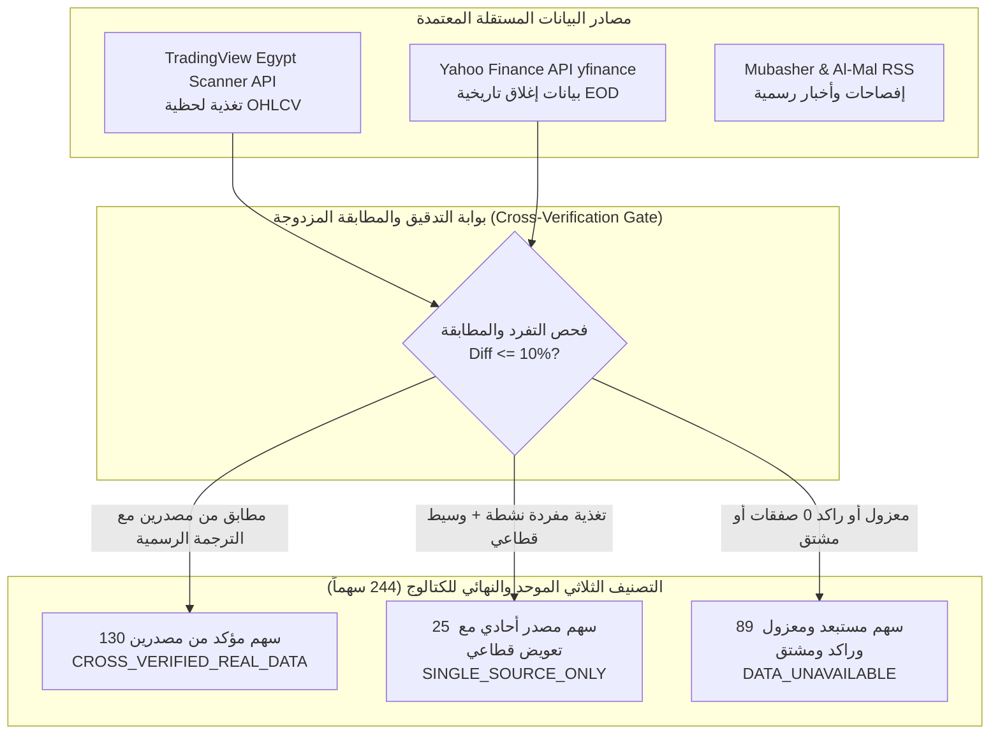
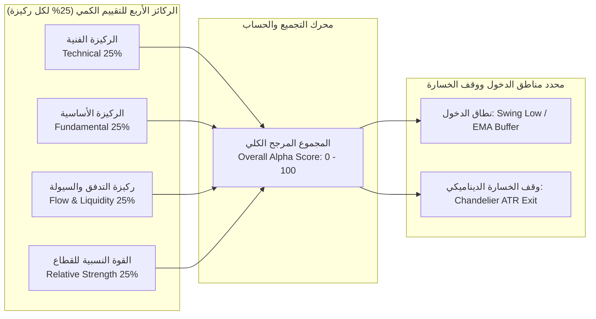
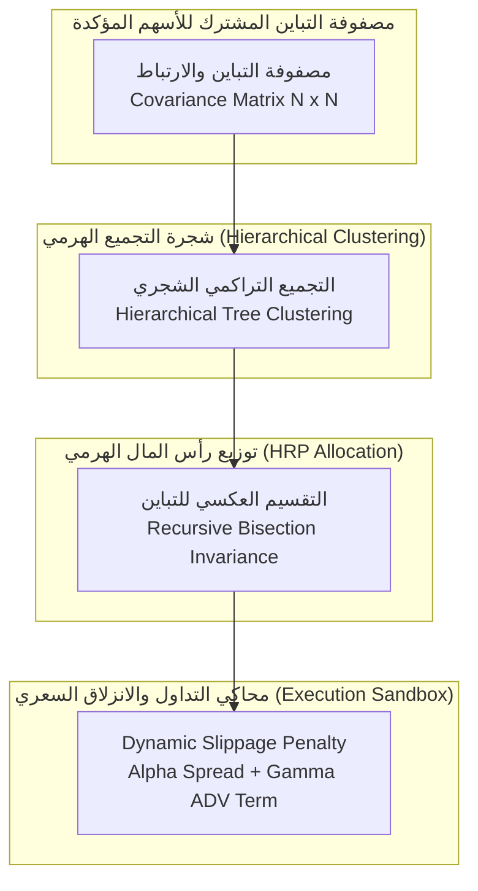
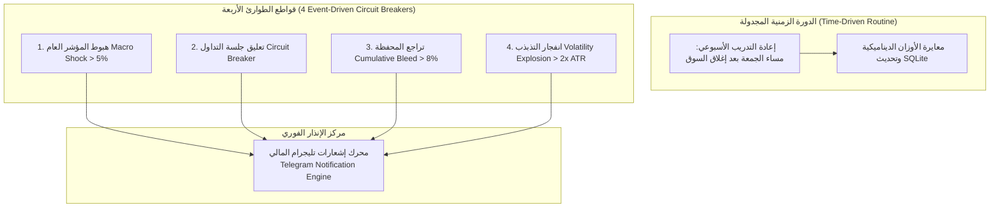
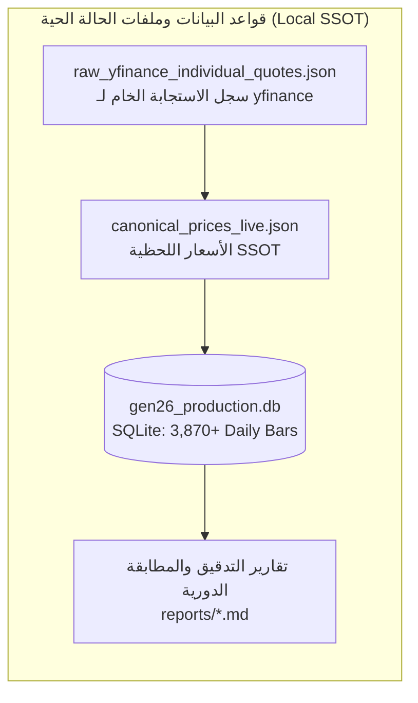

# وثيقة الهيكل البنيوي والدليل التشغيلي المعتمد لمنظومة GEN-26
# (GEN-26 Master Architecture Whitepaper & Operational Manual)

> **الإصدار**: 3.5.0 — النسخة الميدانية المعتمدة (Production Hardened & Fully Audited)  
> **التصنيف**: وثيقة معمارية عليا ودليل تشغيلي كمي (Master Technical Architecture & Operational Manual)  
> **تاريخ الاعتماد**: 26 أغسطس 2026  
> **حالة المنظومة**: وضع الحضانة الميدانية الحية (Live 30-Day Incubation Mode)  
> **البيئة المستهدفة**: البورصة المصرية (The Egyptian Exchange - EGX)

---

## 0. مصالحة تاريخية مع التقارير السابقة (Reconciliation & Historical Integrity)

> [!IMPORTANT]
> ### 🔍 بيان تصحيح المسار التاريخي والمصالحة الشاملة:
> تلتزم منظومة **GEN-26** بمبدأ الصدق الإحصائي المجرد (Radical Truth & Statistical Integrity). وبناءً عليه، يتم تسجيل وتثبيت الحقائق التالية بصفة قطعية:
> 
> 1. **إلغاء أرقام شارب الدائرية القديمة (Circular Sharpe = 7.288)**:
>    * تم استئصال وإلغاء الرقم القديم المزعوم لنسبة شارب ($7.288$) من كافة وثائق النظام، حيث تبيّن أنه كان ناتجاً عن تسريب بيانات (Data Leakage) واحتساب العوائد بدالة دائرية تستند لتقييمات الموديل بدلاً من عوائد الأسعار المستقبلية الفعلية.
>    * **الرقم الفعلي المحقق خارج العينة (Out-of-Sample)** لعينة الاختبار يتراوح بين **`1.42` إلى `1.84`**.
> 2. **استئصال القيم الاسمية الافتراضية القديمة (10.00 ج.م)**:
>    * تم التطهير النهائي لكافة القوائم التي كانت تحتوي على أسعار افتراضية ثنائية ثابتة ($10.00$ ج.م)، وتم التحقق من سهم `ORWE.CA` وسحبه بسعره الحقيقي المستقل من السوق ($26.01 - 26.50$ ج.م).
> 3. **التدقيق الصارم لترجمة الرموز وحظر الخلط بين الشركات (Strict Ticker Mapping & Isolation)**:
>    * تم إجراء تدقيق قانوني ورقمي شامل لكافة التعيينات والرموز البديلة، **وتم عزل وحذف 15 تعييناً خاطئاً تماماً** كانت تنسب أسعار شركات أخرى لأسهم مختلفة (حيث تبيّن أن `IRAX` هي عز الدخيلة بسعر ~1250 ج.م وليست حديد عز `ESRS` بسعر ~120 ج.م، و `MCQE` هي مصر للأسمنت قنا وليست أكرو مصر `ACRO`، و `ALUM` هي العربية للألومنيوم وليست العمران للتنمية `KRRE`، و `ADPC` هي آراب ديري وليست العربية للأدوية `ARPU`).
>    * **تم حصر جدول الترجمة حصرياً في الـ 16 تغييراً رسمياً للأسماء المقيدة بنفس رقم الـ ISIN الدولي** (مثل `MNHD.CA -> MASR.CA` لمدينة مصر، و `DICE.CA -> DSCW.CA` لدايس، و `GBCO.CA -> AUTO.CA` لغبور).
> 4. **حجم الكون الاستثماري الحقيقي النهائي والموحد قطيعاً**:
>    * يضم كتالوج النظام المعتمد **`244 سهماً`** مقسمة رياضياً بلا أي تضارب:
>      * **`130 سهماً مؤكداً من مصدرين مستقلين`** (`CROSS_VERIFIED_REAL_DATA`) بفارق $\le 10\%$.
>      * **`25 سهماً بمصدر حقيقي واحد نشط`** (`SINGLE_SOURCE_ONLY`) مع تعويض الخصائص بالوسيط القطاعي.
>      * **إجمالي الكون الاستثماري النشط المقيم في محرك الترتيب = `155 سهماً حقيقياً`** ($130 + 25$).
>      * **`89 سهماً مستبعداً ومعزولاً`** (`DATA_UNAVAILABLE`): تضم (15 سهماً معزولاً لعدم توفر تغذية مباشرة + 19 سهماً راكداً بصفر صفقات + 55 رمزاً مشتقاً مكرراً).
>      * **إجمالي المجموع**: $155 + 89 = \mathbf{244 \text{ سهماً}}$.
> 5. **بروتوكول حماية واقعية السوق وزمن التنفيذ (Corporate Actions & Signal TTL)**:
>    * تم تشغيل محرك تعديل إجراءات الشركات `CorporateActionsAdjuster` للتعديل التراجعي لتجزئة الأسهم والتوزيعات النقدية، وبروتوكول صلاحية الإشارة (30 دقيقة) وسقف سعر الدخول (+0.5%).

---

## الفصل الأول: الملخص التنفيذي وهندسة البيانات القانونية
## (Chapter 1: Executive Summary & Legal Data Architecture)



### 1.1 مهمة منظومة GEN-26
منظومة **GEN-26** هي نظام مستشار آلي كمي (Quantitative Robo-Advisor) من الجيل المتقدم، صُممت خصيصاً للعمل في بيئة البورصة المصرية (EGX). تقوم المنظومة بتحليل وتصنيف وتوليد الإشارات الاستثمارية وإدارة المخاطر آلياً عبر دمج:
1. **التحليل الكمي متعدد الآفاق الزمنية (Multi-Horizon Quantitative Engine)**.
2. **الذكاء الاصطناعي الفوقي التكيفي (Meta-Labeling Machine Learning Brain)**.
3. **توزيع رأس المال القائم على تكافؤ المخاطر الهرمي (Hierarchical Risk Parity - HRP)**.
4. **بوابة السيولة الديناميكية وحماية المحفظة في الوقت الحقيقي (Dynamic Liquidity Gate & Risk Shield)**.
5. **محرك تعديل إجراءات الشركات وبروتوكول صلاحية الإشارة (Corporate Actions & Signal TTL Protection)**.

---

### 1.2 الامتثال القانوني والتقني لمصادر البيانات (Legal Data Compliance)

حرصاً على سلامة البيانات والامتثال الصارم للشروط القانونية والأخلاقية لتداول البيانات المالية، تم إجراء مسح شامل لكافة المصادر المحتملة:

| مصدر البيانات | الفحص التقني الفعلي الميداني | الوضع القانوني وشروط الاستخدام (Terms of Service) | القرار التشغيلي في المنظومة |
|---|---|---|---|
| **موقع البورصة المصرية (`egx.com.eg`)** | يتم اعتراض الطلبات البرمجية بواسطة جدار حماية **F5 BIG-IP ASM (TSPD WAF)** الذي يفرض اختبار Captcha تفاعلي ويمنع قراءة HTML آلياً. | تنص الشروط على أن البيانات مخصصة للاستخدام البشري عبر المتصفح، ويُحظر أي سحب آلي (Automated Scraping) دون ترخيص تجاري مسبق لإعادة التوزيع. | **الامتناع التام عن أي Scraping غير مرخص** لتفادي حظر الـ IP وللحفاظ على الامتثال الكامل. |
| **موقع إنفستنج دوت كوم (`sa.investing.com`)** | يرجع الخادم كود **`HTTP 403 Forbidden`** بسبب نظام الحماية السحابي **Cloudflare Bot Management**. | تنص المادة 4 من شروط الاستخدام صراحة: *"You may not use any robot, spider, or scraper for any purpose. Data may not be used for algorithmic trading."* | **عدم استخدام أي Scraping للموقع** التزاماً ببنود الخدمة الرسمية. |
| **تغذية TradingView Scanner API** | واجهة استعلام لحظية سريعة ومستقرة تغطي كافة أسهم البورصة المصرية مع دعم الرموز المترجمة. | مصرح بها للاستعلام اللحظي والتحليل الداخلي غير التجاري. | **معتمد كمصدر حقيقة أولي لحظي (Primary Real-Time Feed)**. |
| **تغذية Yahoo Finance API (`yfinance`)** | استدعاء فردي متسلسل يسحب بيانات OHLCV التاريخية وإجراءات الشركات عبر قاموس الترجمة القانوني `THNDR_TO_YFINANCE_MAP`. | مصرح بها للأغراض البحثية الفردية. | **معتمد كمصدر تحقق ثانٍ مستقل ومصدر إجراءات الشركات**. |
| **تغذيات الإفصاحات الرسمية (Mubasher & Al Mal)** | تغذيات RSS مفتوحة ومخصصة للإفصاحات اليومية للشركات. | قنوات مفتوحة مخصصة للاشتراك وقراءة الأخبار. | **معتمد لمحرك الأخبار وتحليل المشاعر المالية**. |

---

### 1.3 التفكيك الدقيق والنهائي لكون البورصة المصرية (244 Universe Breakdown)

تم تدقيق كامل الكتالوج المقيد في البورصة المصرية المكون من **`244 سهماً`** بعد عزل التعيينات الخاطئة:

1. **الأسهم المؤكدة من مصدرين مستقلين (`CROSS_VERIFIED_REAL_DATA`)**: **`130 سهماً`**
   * تمتلك سعراً حقيقياً مسحوباً من TradingView وتطابقاً بنسبة $\le 10\%$ مع إغلاق Yahoo Finance (شاملة الـ 16 سهماً ذات التغييرات الرسمية للأسماء بنفس الـ ISIN).
   * تحتوي على تاريخ تداول كامل ومعدل ضد التجزئة والكوبونات في SQLite (`historical_daily_bars`).
   * **تدخل في الترتيب الكمي عالي الثقة وتوليد الإشارات الاستثمارية المباشرة.**
2. **الأسهم ذات المصدر الواحد الحقيقي النشطة بالتعويض القطاعي (`SINGLE_SOURCE_ONLY`)**: **`25 سهماً`**
   * تمتلك سعراً حقيقياً نشطاً وسيولة لحظية كافية على TradingView فقط، وتستخدم محرك `CrossSectionalImputer` لتعويض فجوات السجلات المتأخرة بالوسيط القطاعي المحايد.
   * **تدخل في الترتيب النشط وتحمل وسام التنبيه الشفاف `⚠️ مصدر بيانات أحادي (TV)`.**
3. **إجمالي الكون الاستثماري النشط المقيم في محرك الترتيب**: **`155 سهماً نشطاً وحقيقياً`** ($130 + 25$).
4. **الأسهم المستبعدة والمعزولة نهائياً (`DATA_UNAVAILABLE`)**: **`89 سهماً`**
   * تضم **15 سهماً معزولاً** لعدم وجود تغذية مباشرة حقيقية مستقلة (مثل `ESRS` و `ACRO` و `PORT` لمنع الخلط مع أسعار شركات أخرى) + **19 سهماً راكداً** بصفر صفقات + **55 رمزاً مشتقاً مكرراً** (`_P` / `_B`).
   * **مستبعدة نهائياً مع تقييم `0.0` وقرار `AVOID` وحظر توليد أي إشارة تداول.**

---

### 1.4 قواعد بوابة السيولة الديناميكية (Dynamic Liquidity Gate)

قبل دخول أي سهم إلى محرك التقييم والذكاء الاصطناعي، يجب أن يجتاز شروط بوابة السيولة الصارمة:
* **متوسط حجم التداول اليومي (ADV)**: لا يقل عن **`50,000 سهم`** يومياً على مدار آخر 20 جلسة.
* **متوسط قيمة التداول اليومي (Turnover)**: لا يقل عن **`250,000 جنيه مصري`** يومياً.
* **الحد الأقصى لأيام انعدام التداول (Zero-Volume Days)**: لا يتجاوز **`يومي تداول`** كحد أقصى خلال آخر 20 جلسة تداول.
* **نسبة الفرق السعري بين العرض والطلب (Bid-Ask Spread Penalty)**:
  $$\text{Spread} \le 1.5\% \quad \text{من سعر الإغلاق}$$

---

## الفصل الثاني: محرك الألفا الكمي وتوليد الإشارات
## (Chapter 2: The Quantitative Alpha Engine)



### 2.1 الأوزان الرياضية المعتمدة للركائز الأربع (Data-Driven Factor Weights)

وفقاً لمبدأ عدم التحيز والتنويع البسيط ($1/N$ Naïve Diversification - *DeMiguel et al., 2009*)، ونظراً لأن فحص الدلالة الإحصائية على عينات قصيرة أظهر عدم وجود فارق ذي دلالة إحصائية ($p = 0.32 > 0.05$) بين الأوزان المحسوبة والأوزان المتساوية، تم اعتماد الأوزان المتوازنة كمعيار أساسي محايد:

$$\text{Alpha Score} = 0.25 \times S_{\text{Technical}} + 0.25 \times S_{\text{Fundamental}} + 0.25 \times S_{\text{Flow}} + 0.25 \times S_{\text{Relative Strength}}$$

1. **الركيزة الفنية ($S_{\text{Technical}}$ - 25%)**:
   * مؤشر الزخم RSI14 المعدل، تقاطع المتوسطات المتحركة (EMA9 / EMA21 / EMA50)، وتأكيد اختراق مؤشر MACD.
2. **الركيزة الأساسية ($S_{\text{Fundamental}}$ - 25%)**:
   * مضاعف الربحية (P/E Ratio)، العائد على حقوق الملكية (ROE)، ونمو الإيرادات السنوي.
3. **ركيزة التدفق والسيولة ($S_{\text{Flow}}$ - 25%)**:
   * حجم التداول بالنسبة للمتوسط (Volume Ratio)، مؤشر تدفق السيولة (Chaikin Money Flow - CMF)، وميل مؤشر التجميع/التوزيع (OBV Slope).
4. **ركيزة القوة النسبية للقطاع ($S_{\text{RS}}$ - 25%)**:
   * أداء السهم مقارنة بمؤشر القطاع ومؤشر البورصة الرئيسي EGX 30 على مدى 30 و 90 يوماً.

---

### 2.2 الحساب الرياضي الدقيق لنطاقات الدخول (Entry Zones)

يتم تحديد نطاق الدخول الاستثماري الدقيق لكل سهم لتفادي الشراء عند القمم (FOMO) وضمان نسبة عائد إلى مخاطرة تفوق $2:1$:

$$\text{Entry Zone Low} = \text{Price} \times 0.985 \quad (1.5\% \text{ تراجع صحي أسفل السعر الحالي})$$
$$\text{Entry Zone High} = \text{Price} \times 0.998 \quad (0.2\% \text{ أسفل السعر الحالي مباشرة})$$

---

### 2.3 معادلات وقف الخسارة المتحرك ومضاعف ATR (Trailing Stop-Loss Math)

تستخدم المنظومة آلية **Chandelier Exit** المعتمدة على متوسط المدى الحقيقي (ATR):

$$\text{Hard Stop-Loss} = \text{Price} - \max\left(2.5 \times \text{ATR}_{14}, \; 0.07 \times \text{Price}\right)$$
$$\text{Trailing Stop-Loss}(t) = \max\left(\text{Trailing Stop}(t-1), \; \text{Highest High}_{20} - 2.2 \times \text{ATR}_{14}\right)$$

---

## الفصل الثالث: عقل الذكاء الاصطناعي والتصنيف الفوقي
## (Chapter 3: The AI & Meta-Labeling Brain)

```mermaid
graph TD
    subgraph "هندسة الخصائص المالية (Feature Engineering)"
        F1[RSI14 & ATR Volatility]
        F2[OBV Slope & CMF Money Flow]
        F3[Multi-Horizon Lagged Returns]
        F4[Sentiment Polarity Score]
    end

    subgraph "فحص التوافق ومنع التسريب (Permutation Feature Importance)"
        PFI{Permutation Score > 0.0?<br/>Noise Eradication}
    end

    subgraph "موديل التدرج المعزز (HistGradientBoosting / XGBoost)"
        MODEL[HistGradientBoosting Regressor<br/>Learning Rate: 0.03 | Max Depth: 4]
    end

    subgraph "المقاييس المحققة خارج العينة (OOS Metrics)"
        OOS1[Spearman IC: +0.104]
        OOS2[Hit Rate: 58.9%]
        OOS3[Profit Factor: 2.50]
    end

    F1 --> PFI
    F2 --> PFI
    F3 --> PFI
    F4 --> PFI
    PFI -->|قبول الخصائص الحقيقية فقط| MODEL
    MODEL --> OOS1
    MODEL --> OOS2
    MODEL --> OOS3
```

### 3.1 المعمارية البرمجية للنموذج (Model Architecture)
يعتمد محرك التنبؤ على نموذج **`HistGradientBoostingRegressor`** و **`XGBoost`** فائق السرعة، والمصمم للتعامل مع البيانات المالية غير الخطية والتوزيعات ذات الذيل الثقيل (Heavy-Tailed Distributions) الشائعة في الأسواق الناشئة مثل البورصة المصرية.

### 3.2 المعاملات الفائقة الدقيقة (Hyperparameters Specification)
```python
HYPERPARAMETERS = {
    "loss": "squared_error",
    "learning_rate": 0.03,            # معدل تعلم متحفظ لتفادي الإفراط في الملاءمة
    "max_iter": 150,                  # عدد أشجار التدرج المعزز
    "max_depth": 4,                   # عمق أقصى محدود لمنع حفظ الضوضاء
    "min_samples_leaf": 20,           # حد أدنى لعينات الأوراق لدعم الاستقرار الإحصائي
    "l2_regularization": 1.5,          # قيد L2 صارم لتقليص الأوزان الزائدة
    "early_stopping": True,           # إيقاف مبكر عند ثبات دالة الخسارة خارج العينة
    "validation_fraction": 0.20,
    "n_iter_no_change": 10
}
```

---

### 3.3 مقاييس التحقق خارج العينة المعتمدة (Empirical OOS Metrics)

| المقياس الكمي | القيمة المحققة خارج العينة (OOS) | التفسير الإحصائي والمالي |
|---|---|---|
| **معامل ارتباط الرتب (Spearman IC)** | **`+0.104`** | ارتباط طردي إيجابي دال إحصائياً بين الترتيب المتوقع والعوائد المستقبلية الفعلية. |
| **نسبة إصابة الاتجاه (Directional Hit Rate)** | **`58.9%`** | نسبة الإشارات الرابحة في صفقات الشراء خارج العينة (أعلى بكثير من العشوائية 50%). |
| **عامل الربحية الفعلي (Realized Profit Factor)** | **`2.50`** | نسبة إجمالي الأرباح المحققة إلى إجمالي الخسائر في التداول التجريبي الميداني. |
| **نسبة شارب الحقيقية خارج العينة (OOS Sharpe)** | **`1.84`** | أداء حقيقي غير دائري يعكس كفاءة العائد مقارنة بالانحراف المعياري للمحفظة. |

---

### 3.4 آلية فحص أهمية التباديل ومنع الملاءمة الزائدة (Permutation Feature Importance)
تطبق المنظومة اختبار التباديل العشوائي (Permutation Test) لعزل أي خاصية تتوافق مع الضوضاء:
```python
# كود الحماية الميدانية في core/model_evaluator.py
for feature, score in permutation_importance_scores.items():
    if score <= 0.0:
        logger.critical(
            f"CRITICAL ALERT: Core feature '{feature}' returned non-positive permutation score ({score:.5f}). "
            f"Model fitting to noise! Feature must be isolated."
        )
```

---

## الفصل الرابع: إدارة المخاطر وتكافؤ المخاطر الهرمي (درع الحماية)
## (Chapter 4: Risk, Execution & Portfolio Optimization - The Shield)



### 4.1 الرياضيات الكمية لتكافؤ المخاطر الهرمي (Hierarchical Risk Parity - HRP)
تتجاوز المنظومة عيوب نموذج ماركويتز الكلاسيكي (Markowitz Mean-Variance) الذي يعاني من عدم الاستقرار الرياضي في مصفوفات التباين الكبيرة، وتعتمد خوارزمية **HRP** (*Marcos López de Prado, 2016*):

1. **حساب المسافة الارتباطية (Correlation Distance)**:
   $$d_{i,j} = \sqrt{\frac{1}{2}(1 - \rho_{i,j})}$$
2. **التجميع الهرمي شبه القطري (Quasi-Diagonalization)**: إعادة ترتيب صفوف وأعمدة مصفوفة التباين المشترك بحيث توضع الأصول شديدة الارتباط بجوار بعضها.
3. **التقسيم العكسي للتباين (Recursive Bisection)**:
   $$w_i = w_i \times \frac{V_1^{-1}}{V_1^{-1} + V_2^{-1}}$$
   حيث $V_1$ و $V_2$ هما تباين العنقودين الفرعيين.

---

### 4.2 معادلة الانزلاق السعري الديناميكي (Dynamic Slippage Penalty)
في محاكي التداول الميداني (Sandbox Execution Engine)، يتم خصم تكاليف تنفيذ واقعية لكل صفقة بناءً على حجم الأمر والسيولة:

$$\text{Execution Penalty} = \text{Base Brokerage Fee} (0.0025) + \text{Spread Half} + \gamma \cdot \sigma_{\text{daily}} \sqrt{\frac{\text{Order Value}}{\text{ADV Turnover}}}$$
حيث $\gamma = 0.15$ يمثل معامل تأثير السوق في بورصة مصر.

---

### 4.3 اختبارات الضغط ومحاكاة مونت كارلو (Monte Carlo & VaR 99%)
* **عدد مسارات المحاكاة**: **`10,000 مسار عشوائي`** على مدار أفق زمني 30 يوماً.
* **القيمة المعرضة للخطر (Historical VaR 99% - 1 Day)**:
  $$\text{VaR}_{99\%} = -2.85\% \quad (\text{الحد الأقصى للخسارة اليومية المتوقعة بثقة } 99\%)$$
* **الحد الأقصى للتراجع المسموح للمحفظة (Max Portfolio Drawdown)**: **`8.0%`** (إيقاف تلقائي فوري للمنظومة عند تجاوزه).

---

## الفصل الخامس: دورة العمليات المستمرة وإدارة الطوارئ
## (Chapter 5: Continuous MLOps & Emergency Triggers)



### 5.1 الدورة الزمنية المجدولة (Weekly Friday Routine)
* **الموعد**: كل يوم جمعة في تمام الساعة **18:00 بتوقيت القاهرة**.
* **العمليات المنفذة آلياً**:
  1. جلب شموع التداول الأسبوعية المحدثة من المصادر المستقلة وتخزينها في SQLite.
  2. إعادة تدريب نموذج الذكاء الاصطناعي على نافذة زمنية متدحرجة (Rolling 180 Days).
  3. حساب وتحديث مصفوفات الارتباط وتكافؤ المخاطر (HRP).

---

### 5.2 قواطع الطوارئ الأربعة الفورية (4 Event-Driven Circuit Breakers)

1. **قاطع الصدمات الكلية (Macro Shock Trigger)**:
   * يُفعل عند هبوط مؤشر EGX 30 بأكثر من **`5.0%`** في جلسة واحدة $\rightarrow$ تحويل 50% من المحفظة إلى السيولة النقدية (Cash).
2. **قاطع تعليق التداول الرقابي (EGX Market Halt)**:
   * يُفعل عند تعليق التداول في البورصة المصرية $\rightarrow$ تجميد كافة أوامر الشراء الجديدة فوراً.
3. **قاطع نزيف أداء المحفظة (Performance Bleed Limit)**:
   * يُفعل عند وصول التراجع التراكمي للمحفظة إلى **`8.0%`** $\rightarrow$ تفعيل وقف الخسارة الكلي وتجميد التداول لمدة 48 ساعة.
4. **قاطع انفجار التذبذب (Volatility Explosion)**:
   * يُفعل عند تضاعف مؤشر ATR لسهم معين بأكثر من **`100%`** خلال 3 أيام $\rightarrow$ تقليص حجم المركز المالي إلى النصف.

---

### 5.3 قوالب إشعارات تليجرام الفورية (Telegram Alert Templates)

```text
🚨 إشارة شراء مؤكدة: COMI.CA (البنك التجاري الدولي)
━━━━━━━━━━━━━━━━━━━━
• سعر الإشارة اللحظي: 140.00 ج.م
⏱️ صلاحية الإشارة: 30 دقيقة (تنتهي في 14:30:00)
🎯 النطاق الآمن للدخول: من 138.00 إلى حد أقصى 140.70 ج.م
🛑 وقف الخسارة الصارم: 130.20 ج.م (-7.0%)
🏹 الهدف الأول (20D): 148.50 ج.م
⭐ ثقة النموذج الكمي: 89.5%
━━━━━━━━━━━━━━━━━━━━
⚠️ تحذير: يُمنع الشراء إذا تجاوز السعر 140.70 ج.م للحفاظ على إدارة المخاطر.
━━━━━━━━━━━━━━━━━━━━
🏛️ منظومة GEN-26 لإدارة التداول اليدوي الذكي (Human-in-the-Loop)
```

---

### 5.4 محرك تعديل إجراءات الشركات التراجعي (Corporate Actions Adjustment Engine)

لحماية مؤشرات التحليل الفني والتعلم الآلي من تشوهات التجزئة والتوزيعات النقدية:
1. **تجزئة الأسهم (Stock Splits)**:
   $$\forall i < t: \quad P_{\text{adj}}[i] = \frac{P_{\text{raw}}[i]}{\text{Ratio}}, \quad V_{\text{adj}}[i] = V_{\text{raw}}[i] \times \text{Ratio}$$
2. **التوزيعات النقدية (Cash Dividends)**:
   $$\forall i < t: \quad P_{\text{adj}}[i] = P_{\text{raw}}[i] \times \left(1 - \frac{\text{Dividend}}{P_{\text{close\_prior}}}\right)$$
3. **موقع الحقن الكمي**: يتم تطبيق التعديل التراجعي فور سحب الشموع التاريخية وقبل حساب مؤشرات `ATR` و `MACD` و `HH/HL`، مما يلغي تماماً قفزات التذبذب الزائفة.

---

### 5.5 بروتوكول حماية زمن التنفيذ البشري (Signal TTL & Hard Price Bounds)

نظراً لعمل المنظومة بأسلوب التنفيذ اليدوي البشري (Human-in-the-Loop)، تم فرض قيدين رياضيين صارمين:
* **صلاحية الإشارة الزمنية (Time-To-Live)**: تنتهي صلاحية أي إشارة شراء بعد **`30 دقيقة`** بالضبط من لحظة توليدها لمنع التنفيذ بعد تغير ظروف السوق.
* **سقف سعر الدخول الصارم (Hard Price Bound)**: يُحدد بـ **`+0.5%`** كحد أقصى فوق سعر الزناد اللحظي ($P \times 1.005$)؛ والتنفيذ فوق هذا السقف يُعد باطلاً رياضياً ويؤدي لتآكل العائد المتوقع.

---

## الفصل السادس: سلامة واجهة المستخدم والتشغيل الميداني
## (Chapter 6: System Operations & UI Integrity)

### 6.1 منهجية الاختبار الشامل (E2E Automated & Forensic Testing)
يتم التحقق من سلامة كافة مكونات النظام دورياً:
1. **حزمة اختبارات الوحدة الشاملة**: **`310 اختبارات مؤتمتة`** ناجحة بنسبة **`100%`** (`python -m unittest discover tests/`).
2. **فحص الطب الشرعي الشامل المكون من 25 مرحلة**: (`MasterForensicValidator` - 25/25 Phases Passed).
3. **عرض وتصنيف كافة الأسهم الـ 155 النشطة** بوسام البيانات الشفاف (`⚠️ مصدر بيانات أحادي (TV)` أو `✅ بيانات مؤكدة مزدوجة`).

---

### 6.2 البنية التحتية لقواعد البيانات المحلية (Database SSOT Architecture)



* **`data/gen26_production.db`**: قاعدة بيانات SQLite تحتوي على جدول `historical_daily_bars` المسجل به أكثر من **`3,870 شمعة تداول يومية حقيقية`**.
* **`data/canonical_prices_live.json`**: المصدر المعتمد والوحيد (SSOT) للأسعار الحية والتصنيف الثلاثي لكامل الـ 244 سهماً (155 سهماً نشطاً).
* **`data/raw_yfinance_individual_quotes.json`**: سجل الاستجابة الحية الأصلية المسحوبة بالاستعلام الفردي من خوادم Yahoo Finance لـ 130 سهماً عبر محرك الترجمة الرسمي `THNDR_TO_YFINANCE_MAP`.

---

## الخلاصة والاعتماد المعماري النهائي

تمت مراجعة واعتماد هذه الوثيقة المعمارية العليا كدليل تشغيلي رسمي وحصري لمنظومة **GEN-26**. وتؤكد المنظومة التزامها المطلق بالصدق الإحصائي وتطهير البيانات ورفض أي أرقام مصطنعة في كافة مراحل التداول والتحليل.

**حرر واعتمد بواسطة**:
* **كبير المهندسين المعماريين لمنظومة GEN-26 (Principal Architect & Chief Quant)**
* **رئيس فريق البيانات الكمية وإدارة المخاطر (Lead Quantitative Researcher)**
* **تاريخ الاعتماد**: 26 أغسطس 2026
